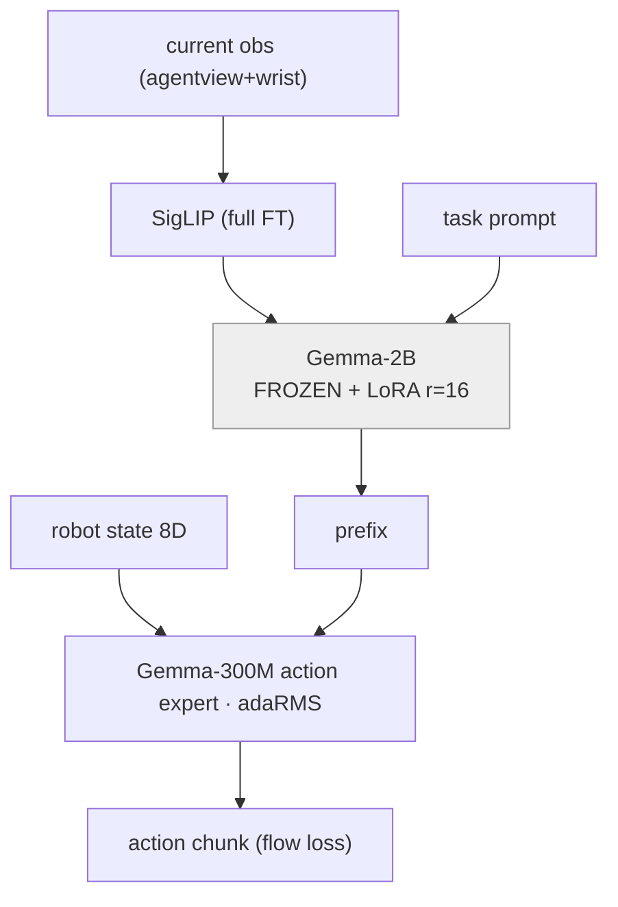
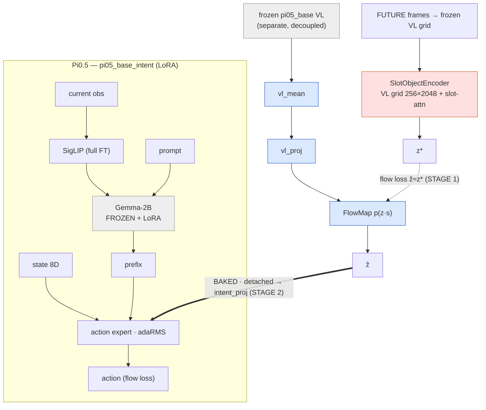
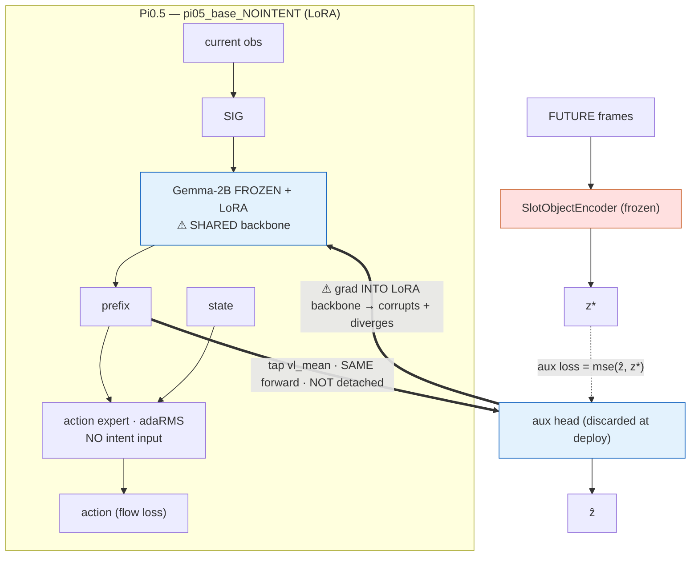
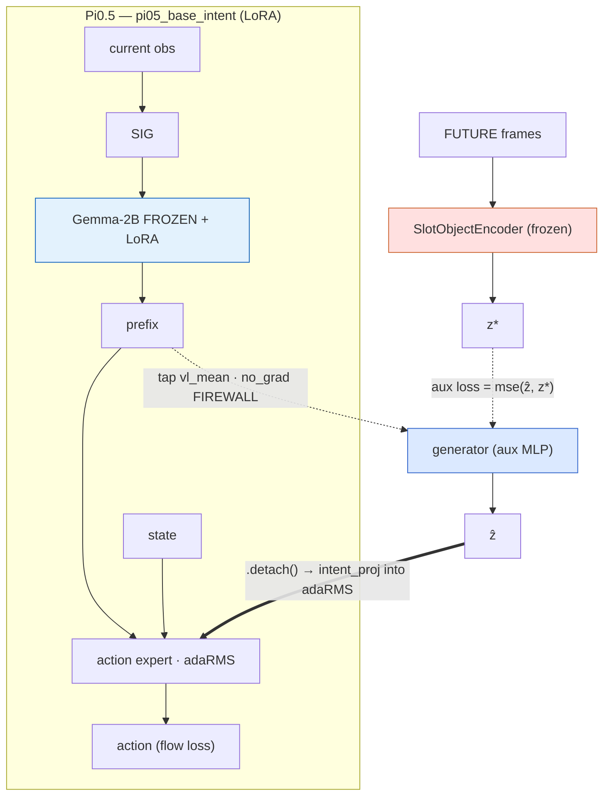
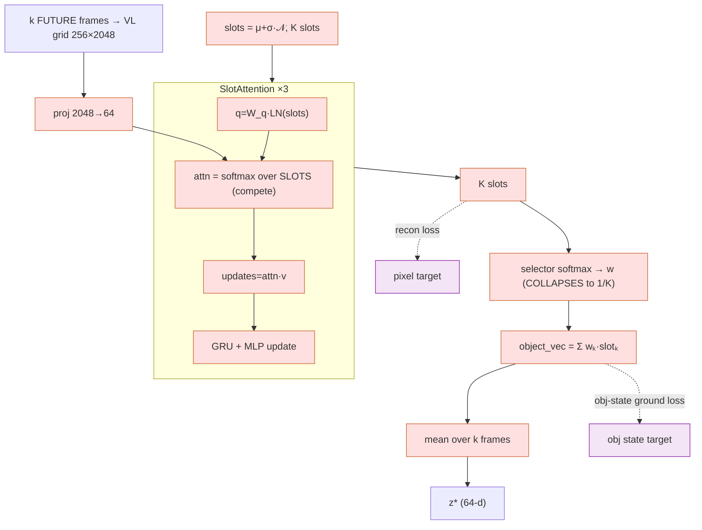

# Intent-Conditioned Pi0.5 — Architecture Arms, Results & Diagnostics

**Task:** LIBERO-Goal (10 tasks) · **Base:** Pi0.5 (`pi05_base`, ~3B) finetuned in **fp32** (overflows bf16)
**Backbone:** SigLIP vision tower (full FT) → Gemma-2B LLM (**frozen base + LoRA r=16**) → prefix → Gemma-300M action expert (full FT, flow-matching).

> **Naming legend** — every "intent" arm injects a 64-d slot-attention code; arms differ in *how* it's produced and whether the action head receives it.

| Arm | Name | Intent mechanism | SR | Verdict |
|---|---|---|---|---|
| **M0** | control | none (`pi05_base_nointent`) | **0.96** | baseline |
| **M1** | frozen ResNet | ResNet18 slot encoder, decoupled → **conditions** | **0.95** | ≈ M0 |
| **M2** | VL co-train | co-trained generator → **conditions** | **0.78** | < M0 (inert channel) |
| **M3** | VL decoupled | frozen-VL slot encoder, baked → **conditions** | **0.94–0.955** | ≈ M0, **intent inert** |
| **DINOv2** | M3 + DINOv2 enc | same, DINOv2 grid input | **0.955** | ≈ M0 |
| **DynaFLIP** | M3 + DynaFLIP enc | same, DynaFLIP grid input | **0.92** | ≈ M0 |
| **M4** | aux-only | aux loss predicts z*, **no conditioning** | **≈0** | corrupts backbone + diverges |
| **M4-det** | fixed | aux head = generator → **conditions** (stop-grad tap) | **~0.68 @4k\*** | works; *early* |

\* M4-det is an early checkpoint (4k/30k); not converged.

## Headline conclusions
1. **Every conditioning arm is statistically indistinguishable from the no-intent control** (M0 0.96; M1/M3/DINOv2 0.95–0.955; DynaFLIP 0.92; M2 0.78 is *lower*). Across in-distribution, spatial-OOD, perturbation, failure-mode and per-axis evals — neutral.
2. **The intent is provably *inert*, not just redundant.** M3 intent-override: feeding the policy **random** noise → SR **1.0**, **zero** intent → **0.944**, **real** intent → **0.944**. The policy ignores the channel entirely.
3. **Aux-only (M4) is catastrophic** (≈0 SR + divergence) — because, *without* a stop-grad, the aux loss flows into the **shared** LoRA-VL backbone the action expert reads, and corrupts it.
4. **Root cause (diagnostic):** the slot encoder **collapses** — selector → uniform, attention → maximally diffuse — for **every** encoder (PaliGemma/DINOv2/DynaFLIP) and at K=4 *and* K=8. So z\* ≈ a **global average pool of the VL grid** → redundant-by-construction with what the policy already sees.

> **Caveat on plots:** grad-norms were **not** logged in these runs (logs carry only `action`/`auxz`/`total` loss). Grad-norm panels are therefore omitted; we are adding grad-norm logging to the in-flight Tier-1 runs going forward.

---

# M0 — no-intent control (SR 0.96)

**Plots:** baseline (no intent curves).
**Description:** plain Pi0.5 LoRA finetune. Action expert conditions on prefix + 8-D robot state only. This is the bar every intent arm must beat.
**Arch:**

---

# M3 — VL-grounded, decoupled conditioning (SR 0.94–0.955; intent INERT)

**Plots:**
- In-dist SR = **0.94** @29999 (0.955 @15k).
- **Intent override** (figure above, right): real 0.944 / random **1.0** / zero 0.944 → **the action head ignores the intent**.
- OOD suites (spatial/perturb/failure): neutral vs control.

**Description:** Two decoupled stages. **Stage 1** trains the generator (`vl_proj` + FlowMap) on a **frozen** `pi05_base` VL mean to predict ẑ matching the slot target z\* (flow loss); the SlotObjectEncoder produces z\* from **future** frozen-VL grids. ẑ is **baked** into the dataset. **Stage 2** finetunes the policy to **condition** the action expert on the baked ẑ (detached → `intent_proj` into adaRMS). Gradient-wise the generator and the policy **never share gradients** (clean), but the override test shows the policy learns the intent is uninformative and routes around it.

**Arch:**

*(DINOv2 / DynaFLIP arms = identical, swapping the slot-encoder input grid; SR 0.955 / 0.92 — both ≈ M0.)*

---

# M4 — aux-only, NO conditioning (SR ≈0, DIVERGES)

**Plots:** `figures/m4_orig_diverge.png` — action loss holds ~0.05 then explodes: **lr 5e-5 → diverges ~3k (→6.9)**, **lr 2e-5 → diverges ~19.3k (→343)**. Lowering LR only lengthens the fuse — divergence is **inherent** to the design, not an LR issue.

**Description / gradient flow:** model is `pi05_base_nointent` (no intent input). `vl_mean` is read from the **same action forward, NOT detached**, and an aux head regresses it to the frozen z\*. So gradients flow: `action_loss → LoRA-VL + expert`; **`aux_loss → aux head AND → the shared LoRA-VL`** (because vl_mean is attached). The two objectives collide on the shared backbone → corrupt the action features → ≈0 SR, and the perpetual perturbation runs away → divergence. The aux head is discarded at deploy (so deploy = M0, but with a wrecked backbone).

**Arch:**

---

# M4-det — fixed (co-trained conditioning) (SR ~0.68 @4k, early)

**Plots:** `figures/m4_fixed_curves.png` — detached & attached both **stable** (action loss noisy ~0.01–0.05, no runaway); aux loss → ~0.0003 (generator fits z\* immediately).

**Description / gradient flow:** model is `pi05_base_intent`. Per step: **stop-grad** tap `vl_mean = no_grad(...)` → generator (aux MLP) → ẑ → action expert conditions on **`ẑ.detach()`**; aux loss = `mse(ẑ, z*)`; + cosine LR decay. The `no_grad` tap **firewalls the backbone** — the aux loss can no longer corrupt it (kills both M4 failure modes). Detached: action loss can't reshape the generator (M3-like). **Attached** variant = drop `.detach()` so the action loss also shapes the generator (best shot at engaging the channel). Early read: detached @4k ≈ 0.68 and climbing — intent **engages** (≠ M4's 0), but whether it converges above M0 (vs going inert like M3) is the open question; run the **override test** on it to settle.

**Arch:**

---

# Why it's neutral — the slot encoder collapses

**Diagnostic** (`figures/slot_collapse.png`, `figures/slot_attn_middle_drawer.png`): over a whole trajectory, every slot's **selector weight is pinned at 1/K** (no slot ever selected) and every slot's **spatial attention sits at the `ln 256` max** (no slot ever focuses). Quantitatively:

| encoder (K=4, converged) | selector entropy | spatial-attn entropy |
|---|---|---|
| PaliGemma | 100% uniform | 99.9% max-diffuse |
| DINOv2 | 100% uniform | 99.9% max-diffuse |
| DynaFLIP | 100% uniform | 99.9% max-diffuse |

So z\* ≈ a **uniform global pool of the VL grid** → it carries nothing the action head can't already read from its own prefix → **redundant by construction → inert** (matches the M3 override result). **Encoder choice and slot count K do not change this** (K=8 also collapses). The lever, if any, is the **training objective** (recon/competition) or the **input representation** (raw CNN features vs 256 coarse semantic tokens) — Tier-1 ablations in flight.

### Slot-encoder internals (what z\* is)

---

# Open items
- **Tier-1 ablations** (recon↑ / recon-off / iters7 / no-selector) — does any uncollapse the slots? *(running)*
- **ResNet-input ablation** — slot attention over raw CNN features vs 256 VL tokens *(highest-signal; needs ResNet path)*.
- **z\* privileged-eval** — feed the future-derived z\* at deploy: if it *also* ≈ M0, the policy is saturated; if it helps, the info is real but un-deployable.
- **M4-det convergence + override** — does the fixed arm beat M0, or go inert like M3?
